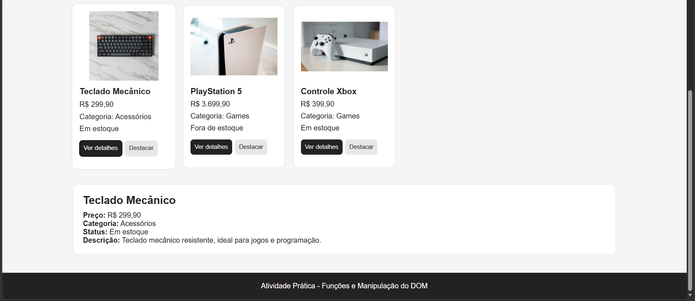
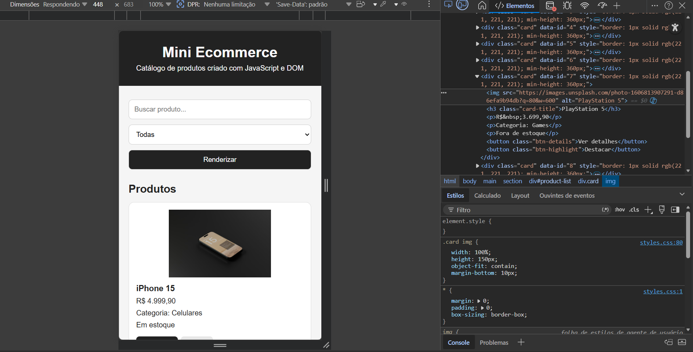

# Mini Ecommerce - Funções e Manipulação do DOM

## Nome
Pedro Henrique Nascimento Cézar

## Matrícula
907398

## Descrição do projeto
Este projeto é uma atividade prática de JavaScript, HTML e CSS, com foco em funções e manipulação da linguagem.

A página simula um mini ecommerce, exibindo produtos em formato de cards. Os produtos são carregados a partir de um objeto JSON no arquivo `script.js`.

## Funcionalidades

- Renderização dinâmica de produtos em cards
- Busca por nome do produto
- Filtro por categoria
- Botão para ver detalhes do produto
- Botão para destacar visualmente o card
- Uso de eventos com `addEventListener`
- Uso de métodos do DOM como:
  - `getElementById`
  - `querySelector`
  - `querySelectorAll`
  - `createElement`
  - `setAttribute`
  - `appendChild`
  - `innerHTML`
  - `classList.add`
  - `style`

## Prints

### Tela com os cards renderizados
 

### Área de detalhes preenchida

### Console do navegador

